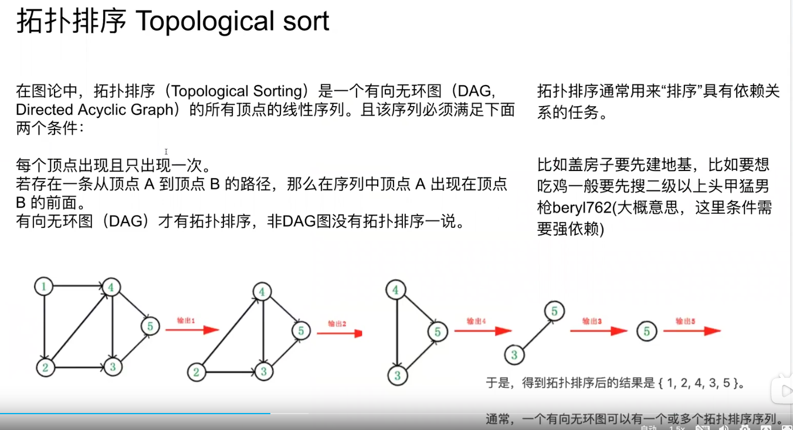

https://leetcode.com/discuss/interview-question/2362862/Amazon-Leadership-Principle-Interview-Questions
https://www.bilibili.com/video/BV1ef4y1d7co?spm_id_from=333.337.search-card.all.click&vd_source=1368a6bf9d20262ce61b6f690c7dd3d7
## coding questions 
353 
261
210
2127
204


Method 1: 
```aidl
private boolean isCyclicDirectedGraph3(int n) {
    int[] indegree = new int[n];
    for(int startNode : graph.keySet()) {
        List<Integer> neighbors = graph.getOrDefault(startNode, new ArrayList<>());
        
        for(int endNode : neighbors) {
            indegree[endNode]++;
        }
    }    
    Queue<Integer> q = new LinkedList<>();
    for(int i = 0; i < n; i++) {
        if(indegree[i] == 0) q.offer(i);
    }
    int count = 0;
    while(!q.isEmpty()) {
        int cur = q.poll();
        count++;
        for(int nei : graph.getOrDefault(cur, new ArrayList<>())
            if(--indegree[nei] == 0) q.offer(nei);
    }
    return count != n;
}
```

```aidl
public class Solution {
    public List<List<Integer>> getSkyline(int[][] buildings){
        List<List<Integer>> res = new ArrayList<>();
        List<int[]> height - new ArrayList<>();
        
        for(int[] b : buildings) {
            height.add(new int[]{b[0], -b[2]};
            height.add(new int[]{b[1], -b[2]};
        }
        
        Collections.sort(height, (a, b) -> a[0] == b[0] ? a[1] - b[1] : a[0] - b[0]);
        PriorityQueue<Integer> pq = new PriorityQueue<>(a, b) -> (b -a ));
        
        pq.offer(0);
        int preMax = 0;
        for(int[] h : height) {
            if(h[1] < 0) pq.offer(-h[1]);
            else pq.remove(h[1]);
            int curMax = pq.peek();
            if(curMax != preMax){
                res.add(List.of(h[0], curMax));
                preMax = curMax;
            } 
        }
        return res;
    }
}
```
762

Implement a file system (OOP design)
implement an advertising system (sd)
course schedule 2 
shrotest path from left most corner to right most corner in a matrix with oobstacles 

two sum, implement trie 
implement a function top k freq element with time stamp 
level order, top k fre elements 
chess design 

# Part 2 
76
863


```aidl
//backpack 
public int change(int amount, int[] coins) {
    int[][] dp = new int[coins.length+1][amount+1];
    
    for(int i = 0; i <= coins.length; i++) dp[i][0] =1;
    
    for(int i = 1; i <= coins.length; i++) {
        for(int j = 1; j <= amount; j++) {
        dp[i][j] = dp[i-1][j];
        if(j - coins[i-1] >= 0) {
            dp[i][j] += dp[i][j-coins[i-1]];
        }
        
    }
    return dp[coins.length][amount];
}    


```

```aidl
int n = 5;
int[] dp = new int[n+1];
int[] ok new int[]{1, 2, 5, 10};

dp[0] = 1;
for(int i : ok) {
for(int j = i; j <= n; j++) {
dp[j] += dp[j-1];
}} return dp[n];
```
