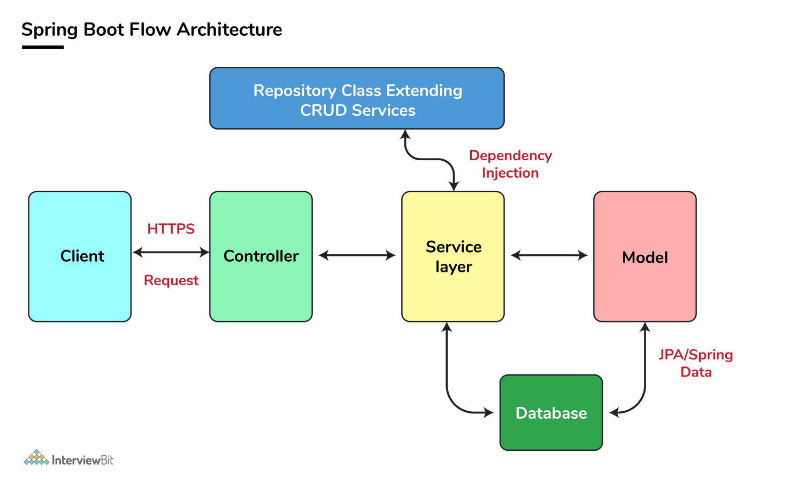

# Controller, Service, Component  
1. The primary annotations that Spring Boot offers reside in its org.springframework.boot.autoconfigure and its sub-packages. Here are a couple of basic ones:
@SpringBootApplication annotation is equivalent to using @Configuration, @EnableAutoConfiguration, and @ComponentScan with their default attributes. 
Spring Boot enables the developer to use a single annotation instead of using multiple. But, as we know, Spring provided loosely coupled features that
we can use for each annotation as per our project needs.
@EnableAutoConfiguration – to make Spring Boot look for auto-configuration beans on its classpath and automatically apply them.
@SpringBootApplication – used to denote the main class of a Boot Application. This annotation combines @Configuration, @EnableAutoConfiguration, and @ComponentScan annotations with their default attributes.

2. ComponentScan: Spring Boot application scans all the beans and package declarations when the application initializes. You need to add the @ComponentScan annotation for your class file to scan your components added to your project.

3. SpringBoot Dependency management
Spring Boot dependency management is used to manage dependencies and configuration automatically without you specifying the version for any of that dependencies.

4. RestController:  @Controller and @ResponseBody, used for creating a restful controller. It converts the response to JSON or XML. It ensures that data returned by each method will be written straight into the response body instead of returning a template.
Diff b/w RestController and Controller: @Controller Map of the model object to view or template and make it human readable but @RestController simply returns the object and object data is directly written in HTTP response as JSON or XML.

5. Spring Actuator 
An actuator is an additional feature of Spring that helps you to monitor and manage your application when you push it to production. These actuators include auditing, health, CPU usage, HTTP hits, and metric gathering, and many more that are automatically applied to your application.
Enable Actuator 
 <dependency>
   <groupId> org.springframework.boot</groupId>
   <artifactId> spring-boot-starter-actuator </artifactId>
   </dependency>

6. @Service @Repository
   @Service and @Repository are special cases of @Component. They are technically the same, but we use them for the different purposes.
   @Repository’s job is to catch persistence-specific exceptions and re-throw them as one of Spring’s unified unchecked exceptions.
   We mark beans with @Service to indicate that they're holding the business logic. Besides being used in the service layer, there isn't any other special use for this annotation.

7. @Component: We can use @Component across the application to mark the beans as Spring's managed components. Spring will only pick up and register beans with @Component, and doesn't look for @Service and @Repository in general.
   They are registered in ApplicationContext because they are annotated with @Component:
   General purpose instance, compute optimized instance, memory optimized instance, accelerated computing instance, storage optimized instance 

## EC2 https://www.javainuse.com/prep/ec2
As part of the Amazon Web Services (AWS) cloud-computing platform, Amazon Elastic Compute Cloud (EC2) provides businesses a flexible approach to reliably achieve their performance goals.
What is EC2? EC2 is the engine behind AWS that allows users to deploy as many virtual machines as necessary with all the advantages of their own state-of-the-art data center, but without the costs. Amazon EC2 makes it easy for you to obtain virtual servers, also known as compute instances or instances, quickly and inexpensively.
What are the features of Amazon EC2?

    Bare Metal instances- Amazon EC2 bare metal instances provide your applications with direct access to the processor and memory of the underlying server.Bare metal instances are built on the Nitro system, a collection of AWS-built hardware offload and hardware protection components that come together to securely provide high performance networking and storage resources to EC2 instances.
    Pause and Resume Your Instances- You will not be charged for instance usage while your instance is hibernated. Storage is charged at standard EBS rates. For more information about hibernation, and supported instance types and operating systems.
    High I/O Instances- High I/O I3 and I3en instances are backed by Non-Volatile Memory Express (NVMe) based SSDs, and are ideally suited for customers running very high performance NoSQL databases, transactional systems, and Elastic Search workloads. High I/O instances also offer sequential disk throughput up to 16 GB/s, which is ideal for analytics workloads.
    Flexible Storage Options- Amazon EBS provides persistent, highly available, consistent, low-latency block storage volumes for use with Amazon EC2 instances. Each Amazon EBS volume is automatically replicated within its Availability Zone to protect you from component failure, offering high availability and durability. It is designed for application managers who need to tune workloads for capacity, performance and cost.
    Elastic IP Addresses- Elastic IP addresses are static IP addresses designed for dynamic cloud computing. An Elastic IP address is associated with your account not a particular instance, and you control that address until you choose to explicitly release it.
    Enhanced Networking- This feature uses a new network virtualization stack that provides higher I/O performance and lower CPU utilization compared to traditional implementations. In order to take advantage of Enhanced Networking, you should launch an HVM AMI in VPC, and install the appropriate driver.

Amazon Elastic Block Store (EBS) is an easy to use, high-performance, block-storage service designed for use with Amazon Elastic Compute Cloud (EC2) for both throughput and transaction intensive workloads at any scale. A broad range of workloads, such as relational and non-relational databases, enterprise applications, containerized applications, big data analytics engines, file systems, and media workflows are widely deployed on Amazon EBS.

How does Elastic Load Balancer work?
A load balancer accepts incoming traffic from clients and routes requests to its registered targets (such as EC2 instances) in one or more Availability Zones. It then resumes routing traffic to that target when it detects that the target is healthy again.

What is S3?What is it used for?
Amazon Simple Storage Service is storage for the Internet. It is designed to make web-scale computing easier for developers. Amazon S3 has a simple web services interface that you can use to store and retrieve any amount of data, at any time, from anywhere on the web.
It is used for:
industry-leading scalability, data availability, security, and performance.

9. ecommerce group

check out: trip system
put transactions on data lake
q pore system: consumer - travel agent books, 15 hotels pay all together
financial management: pay front, ifg you don't pay front, they take it back

## design question 
https://proxysql.com/blog/configure-read-write-split/
Design Question 要畫圖: if there are 1000 tps to save to db and publish, you need to request customerInfo and publish customerAddress and id, how will you design and what tech will be used?

HAProxy can configure to listen onto two ports: one as an endpoint for writers, while the second prot as an endpoint for reads. 
One of the more powerful features of MySQL Proxy is the abilit yto do "Read/Write Splitting". The basic concept is to have a master database handle transactional queries while slaves 
handle SELECT queries. Replication is used to synchronize the changes due to transactional queries with the slaves in the cluster. 
<4k tps using sql: 
read write separate, using two servers, multiple replicates 
>4k NoSQL 

## How do you handle 2GB of string swapping?
ex: "This is an example" -> " is This example an"
Split to mutiple pieces, and index each piece, check then swap 

ordering services

skillset: basic
99% backend work

cloud only
EC2 - storage
Java
Kotlin -

Scala

remote protocol

gRPC 

https://blog.dreamfactory.com/grpc-vs-rest-how-does-grpc-compare-with-traditional-rest-apis/#:~:text=“gRPC%20is%20roughly%207%20times,HTTP%2F2%20by%20gRPC.”

## feeedback
Here is my feedback for the interview-
Not as strong as the role expectations in areas like
Dependency Injection and SpringBootDesign Software components for a simple systemExtensive AWS/Cloud knowledgeSystem & Technology application – When/where/why to use a technology
Expected more honest answers from Sandeep. A few instances are
When asked about DB scalability, he mentioned that he had worked on it. When I probed into the points brought up by him in the interview, Sandeep took back his statements.Data Lakes and its usages. He may have used it, but I did not get right answers.No instances where he could not collaborate or having different opinions with the other team members.TPS for the services – random and very high number was given
Mainly focused on his last project (Processing the data from Ibris system)
Did bring up some good points about Parallelism in Java, but would have been better if explained how it improved/optimized the system performance.Good knowledge in Oracle RDBMS concepts

Overall, I do not see him matching with the Senior level skillset.

## https://docs.google.com/document/d/1xfQ8Cep96aR5VkRUmtQ4PoP4hb3YGOw0DdtOqcl2-GI/edit#
