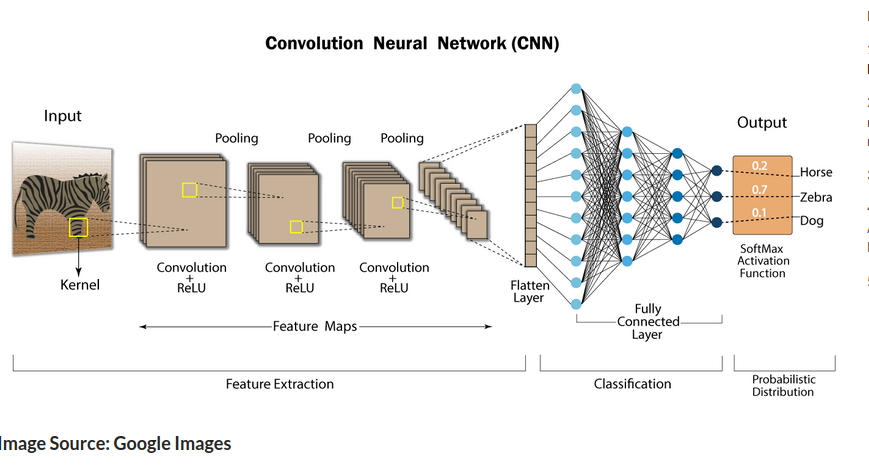

## Convolutional neural networks  (CNN)
1. perform analysis on images and visuals 
2. widely used: image recognition and image classification, object detection, recognition of faces 

CNN takes an image as an input, processes it, and classifies it under certain categories 

## Why do we prefer CNN over Artificial neural networks (ANN) for image data as input 
1. Feedforward neural networks can learn a single feature representation of the image but in the case of complex images, ANN will fail to give better predictions, this is because it cannot learn pixel dependencies present in the images.

2. CNN can learn multiple layers of feature representations of an image by applying filters, or transformations.

3. In CNN, the number of parameters for the network to learn is significantly lower than the multilayer neural networks since the number of units in the network decreases, therefore reducing the chance of overfitting.

4. Also, CNN considers the context information in the small neighborhood and due to this feature, these are very important to achieve a better prediction in data like images. Since digital images are a bunch of pixels with high values, it makes sense to use CNN to analyze them. CNN decreases their values, which is better for the training phase with less computational power and less information loss.

## Explain the different layers in CNN.

## Explain the significance of the RELU Activation function in Convolution Neural Network.

## Can we use CNN to perform Dimensionality Reduction? If Yes then which layer is responsible for dimensionality reduction particularly in CNN?

## Explain the role of the Convolution Layer in CNN.

## Explain the significance of “Parameter Sharing” and “Sparsity of connections” in CNN.

## Let us consider a Convolutional Neural Network having three different convolutional layers in its architecture as –

##  What are the problems associated with the Convolution operation and how can one resolve them?

## Briefly explain the two major steps of CNN i.e, Feature Learning and Classification. 

## What is the role of the Fully Connected (FC) Layer in CNN?

##  List down the hyperparameters of a Pooling Layer.

## Explain the role of the flattening layer in CNN.

## What is Stride? What is the effect of high Stride on the feature map?

## Does the size of the feature map always reduce upon applying the filters? Explain why or why not.

##  What are the different types of Pooling? Explain their characteristics.

## Explain the terms “Valid Padding” and “Same Padding” in CNN.

## An input image has been converted into a matrix of size 12 X 12 along with a filter of size 3 X 3 with a Stride of 1. Determine the size of the convoluted matrix.

## What is the size of the feature map for a given input size image, Filter Size, Stride, and Padding amount?

## Why do we use a Pooling Layer in a CNN?

## 