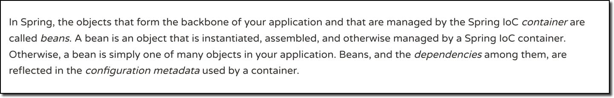

## Why spring 
popular framework for building java applications 
initially a simpler and lightweight alternative to J2EE
provides a large number of helper classes ... make thing easier 
Simply Java Enterprise Development 

## J2EE
Client side presentation: 
Server side presentation: JSPE serives, xml services
Server-side business logic: Java Bean
database

## Spring 5 2017
Updated minimum requirements for Java 8 or higher 
Deprecated legacy integration for: Tiles, Velocity, Portlet, Guava etc
Upgraded Spring MVC to use new version of Servelet API 4.0
Added new reactive programming framework: Spring WebFlux 

www.luv2code.com/spring-5-whats-new
www.luv2code.com/spring-5-faq

## Goals of Spring 
lightweight development with Java POJOs (Plain-Old-Java-Objects)
DI to promote loose coupling
Declarative programming with Aspect-Objected-Programming (AOP)
Minimize boilerplate Java Code 

# Core Container
Bean factory for creating beans: basically reconfigure files, properties and dependencies 
Bean
Core 
SpEL: Spring Expression Language 
Context 
## Infrastructure 
AOP: Aspect Oriented Programming and functionality to objects declaratively 
    - allow you create these applications like Logging, security, transactions, etc. 
    - apply these service to your objects with clear fashion without modify 
Aspects 
Instrumentation: Java agents to remotely monitor your app with JMX (Java Management Extension)
Messaging 

## Data Access Layer 
JDBC: spring provide helper classes, reduce your JDBC code by 50% 
ORM: Object to relational mapping, integration with hibernate and JPA 
Transactions : make heavy use of AOP behind the scenes 
OXM 
JMS: Java Message Service, allow send message to MessageQ, for sending async messages to a Message broker, spring provides helper classes for JMS 

## Web Layer 
Servlet 
WebSocket
Web
Portlet 
All web related classes, home of the Spring MVC framework 

## Test Layer 
Unit
Integration
Mock

Supports Test-Driven-Development (TDD) Mock objects and out-of-container testing 

## What are Spring "Projects"
Additional Spring modules built-on top of the core Spring Framework
Only use what you need..
- spring cloud, spring data 
- spirng batch, spring security
- Spring for android, Spring Web Flow
- Spring Web Services, Spring LDAP 
- spring.io/projects

## Inversion of Control (IoC) 
Simply the design process of externalizing, the construction and management of your obj. 
outsource to an object factory and management of your obj. That outsourcing will be handled by a obj factory. 

implements Interface 
@Override 
interface methods 

## Spring Container 
Primary functions:
    - create and manage objects (Inversion of control)
    - Inject obj's dependencies (DI)

Configuring Spring Container: 
    - XML configuration file (legacy, but most legacy apps still use this)
       
    - Java Annotations (modern)
    - Java Source Code (modern)

## Spring Development process
configure your spring beans
<bean id="beanname" class="package.path.classname"> </bean> id was used to retrieve bean 
create a spring container : spring container: application context 
Specialized implementations: ClassPathXmlApplicationContext, ANnotationConfigApplicationContext, GenericWebApplicationContext
ClassPathXmlApplicationContext context = new ClassPathXmlApplicationContext("applicationCOntext.xml")
retrieve beans from spring container 
Coach theCoach = context.getBean("beanid:, Coach.class); //Coach.clas - interface 
theCoach.method();
context.close();

## DI
The dependency inversion principle 
The client delegates to calls to another obj the responsibility of providing its dependencies 

Constructor Injection: define the dependency interface and class, create a constructor in your class for injections, configure the dependency injection in Spring Config file 
Setter injection 
Auto-wiring 

<bean id="anotherBean" class="package.path.classname"> </bean> id was used to retrieve bean 
Inject dependencies to bean 
<bean id="beanname" class="package.path.classname" ><constructor-arg ref="anotherBean" /> </bean> id was used to retrieve bean 

FAQ: What is a Spring Bean?

A "Spring Bean" is simply a Java object.

When Java objects are created by the Spring Container, then Spring refers to them as "Spring Beans".

Spring Beans are created from normal Java classes .... just like Java objects. 

Source: https://docs.spring.io/spring/docs/current/spring-framework-reference/core.html#beans-introduction

Overview of the steps

1. Create a bean to configure the parent logger and console handler

2. Configure the bean in the Spring XML config file
   Detailed Steps

1. Create a bean to configure the parent logger and console handler

This class will set the parent logger level for the application context. It will also set the logging level for console handler. It sets the logger level to FINE. For more detailed logging info, you can set the logging level to level to FINEST.  You can read more about the logging levels at http://www.vogella.com/tutorials/Logging/article.html

This class also has an init method to handle the actual configuration. The init method is executed after the bean has been created and dependencies injected.

File: MyLoggerConfig.java

    package com.luv2code.springdemo;
     
    import java.util.logging.ConsoleHandler;
    import java.util.logging.Level;
    import java.util.logging.Logger;
    import java.util.logging.SimpleFormatter;
     
    import org.springframework.context.annotation.AnnotationConfigApplicationContext;
     
    public class MyLoggerConfig {
     
    	private String rootLoggerLevel;
    	private String printedLoggerLevel;
    	
    	public void setRootLoggerLevel(String rootLoggerLevel) {
    		this.rootLoggerLevel = rootLoggerLevel;
    	}
     
    	public void setPrintedLoggerLevel(String printedLoggerLevel) {
    		this.printedLoggerLevel = printedLoggerLevel;
    	}
     
    	public void initLogger() {
     
    		// parse levels
    		Level rootLevel = Level.parse(rootLoggerLevel);
    		Level printedLevel = Level.parse(printedLoggerLevel);
    		
    		// get logger for app context
    		Logger applicationContextLogger = Logger.getLogger(AnnotationConfigApplicationContext.class.getName());
     
    		// get parent logger
    		Logger loggerParent = applicationContextLogger.getParent();
     
    		// set root logging level
    		loggerParent.setLevel(rootLevel);
    		
    		// set up console handler
    		ConsoleHandler consoleHandler = new ConsoleHandler();
    		consoleHandler.setLevel(printedLevel);
    		consoleHandler.setFormatter(new SimpleFormatter());
    		
    		// add handler to the logger
    		loggerParent.addHandler(consoleHandler);
    	}
    	
    }

FAQ: Why do we specify the Coach interface in getBean()?

Question

Why do we specify the Coach interface in getBean()?

For example:

Coach theCoach = context.getBean("myCoach", Coach.class);

---

Answer

When we pass the interface to the method, behind the scenes Spring will cast the object for you.

context.getBean("myCoach", Coach.class)

However, there are some slight differences than normal casting.

From the Spring docs:

Behaves the same as getBean(String), but provides a measure of type safety by throwing a BeanNotOfRequiredTypeException if the bean is not of the required type. This means that ClassCastException can't be thrown on casting the result correctly, as can happen with getBean(String).

Source:  http://docs.spring.io/spring-framework/docs/current/javadoc-api/org/springframework/beans/factory/BeanFactory.html#getBean-java.lang.String-java.lang.Class-

## Development process -constructor injection 
1. define the dependency interface and class 
2. Create a constructor in your class for injections 
3. configure the dependency injection in Spring config file

FAQ: What is the purpose for the no arg constructor?

FAQ: What is the purpose for the no arg constructor?

Question:
I was wondering why you created a no arg constructor? I thought that they are implied by Java and only required when you also have an overloaded constructor. Or is this a Spring specific thing?

---

Answered by: Oleksandr Palamarchuk

When you don’t define any constructor in your class, compiler defines default one for you, however when you declare any constructor (in your example you have already defined a parameterized constructor), compiler doesn’t do it for you.

Since you have defined a constructor in class code, compiler didn’t create default one. While creating object you are invoking default one, which doesn’t exist in class code. Then the code gives an compilation error.

Development Process - setter injection
1. create setter methods in your class for injections 
2. Configure the dependency injection in spring config file
<bean id="myCricket" class="com.package.path">
//set up setter injection 
2. <property name="fortuneService" ref="myFortuneService" />
</bean>

## Inject values from properties file 

<property name="email" value="${foo.email}"> 

## Bean Scopes 
Scope refers to the lifecycle of a bean
How long does the bean live?
How many instances are created? 
How is the bean shared? 

Default Scope: Singleton 

Spring Container creates only one instance of the bean, by default 
It is cached in memory 
All requests for the bean: will return a SHARED reference to the SAME bean 

Singleton: creates a single shared instance of the bean. Default scope 
Prototype: creates a new bean instance for each container request.
request: scoped to an HTTP web request. Only used for web apps 
Session: scoped to an HTTP web session. Only used for web apps. 
Global session: scoped to a global HTTP web session. Only used for web apps. 

<beans ..>
    <bean id="myCoach" class="com.example.path" scope="prototype"> </bean>
</beans>